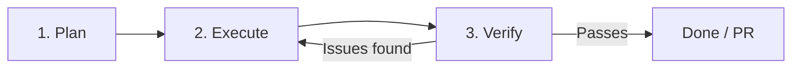

# Agentic Engineering Workflow — Patient Flow

> **Operating manual for building features with GitHub Copilot agents in VS Code.**
>
> This document defines the Plan → Execute → Verify loop, parallel-session strategy, and when to use which agent profile.

---

## The Agentic Loop

Every feature follows this three-phase loop. Never skip phases.

### Phase 1: Plan

**Agent:** `/architect` (or default agent for small tasks)

1. Describe the feature in natural language
2. Attach relevant contracts: `#api_spec.md`, `#schema.md`
3. Ask the agent to produce a **structural spec** — file-by-file plan
4. Review the plan before allowing code generation
5. If schema or API changes are needed → update contracts FIRST, then code

**Output:** A file-by-file plan with schema impact, API impact, and cross-cutting concerns identified.

**Gate:** Do not proceed to Execute until you've reviewed and approved the plan.

### Phase 2: Execute

**Agent:** `/backend-engineer` and/or `/frontend-engineer` (in parallel sessions)

1. Open the approved plan
2. For backend work: invoke `/backend-engineer` with the plan + `#api_spec.md` + `#schema.md`
3. For frontend work: invoke `/frontend-engineer` with the plan + `#api_spec.md`
4. Let the agent generate code — it will run lint/build and check diagnostics
5. If the agent hits issues it can't resolve, pause and review

**Gate:** Code must compile and lint must pass before proceeding to Verify.

### Phase 3: Verify

**Agent:** `/tester` and `/reviewer`

1. Invoke `/tester` to generate unit tests for new/modified services
2. Run `npm test` in `api/` — all tests must pass
3. Invoke `/reviewer` with the changed files + contracts attached
4. Address any **Critical** or **Warning** issues from the review
5. For frontend changes: instruct the agent to "Launch the app in the integrated browser and verify the layout works without console errors"
6. Run `/check-contract-drift` to ensure contracts still match code

**Gate:** Tests pass, review approved, no contract drift → ready for PR.

---

## Parallel Session Strategy

**Do not use one giant chat session to build an entire feature.** Split work across parallel sessions to keep context lean.

| Session | Purpose | Agent Profile | Contracts to Attach |
|---------|---------|---------------|---------------------|
| **Backend** | NestJS modules, services, DTOs, schema | `/backend-engineer` | `#api_spec.md`, `#schema.md` |
| **Frontend** | React components, pages, hooks | `/frontend-engineer` | `#api_spec.md` |
| **Tests** | Unit tests, E2E tests | `/tester` | `#api_spec.md` |
| **Review** | Code review, contract conformance | `/reviewer` | `#api_spec.md`, `#schema.md` |

### When to Compact
If a session starts lagging or making repetitive mistakes:
1. Run `/compact` to summarize history and free context
2. Re-attach the relevant contract files
3. Continue working

### When to Start Fresh
If a session has accumulated too much context (3+ features, 20+ files changed):
1. Start a new session
2. Attach only the contracts and the current task
3. Reference the previous session's output by file, not by chat history

---

## Model Selection Guide

Match the model to task complexity in the unified model picker.

| Task Type | Model Class | Examples |
|-----------|-------------|---------|
| **Core business logic** (FSM, auth, schema design) | Heavy reasoning | GPT-5, Claude 3.5 Sonnet |
| **Multi-file orchestration** (full feature) | Heavy reasoning | GPT-5, Claude 3.5 Sonnet |
| **Frontend styling, boilerplate** | Fast/snappy | GPT-5 mini, Haiku 4.5 |
| **Test generation** | Fast/snappy | GPT-5 mini, Haiku 4.5 |
| **Code review** | Heavy reasoning | GPT-5, Claude 3.5 Sonnet |
| **Contract drift check** | Fast/snappy | GPT-5 mini, Haiku 4.5 |

---

## Contract-First Development

The contracts in `docs/contracts/` are the **source of truth**. Code conforms to contracts, not the other way around.

### When Adding a New Feature
1. **Update `api_spec.md`** — add the new endpoints, request/response shapes
2. **Update `schema.md`** — add new tables, columns, indexes
3. **Then** generate code that implements the contracts
4. **Then** run `/check-contract-drift` to verify

### When Modifying an Existing Feature
1. Update the contract first
2. Then modify the code to match
3. Run `/check-contract-drift`

### Why Contract-First?
- Agents excel at strict constraint matching
- Attaching `#api_spec.md` eliminates up to 90% of structural bugs between frontend and backend
- Contracts serve as documentation, test specs, and review criteria simultaneously

---

## Reliability Engineering

### Self-Correction Loop
Agents must verify their own work before marking a task complete:

1. **Run lint** — `npm run lint` in `api/` or `client/`
2. **Run build/typecheck** — `npm run build` (api) or `npm run check` (client)
3. **Check diagnostics** — use `getDiagnostics` to pull workspace errors
4. **Fix issues** — agent self-corrects before reporting done

### Browser Verification (Frontend)
For UI changes, explicitly instruct:
> "Launch the app in the integrated browser, navigate to [route], and verify the layout works without console errors."

The agent can:
- Navigate to your local dev server
- Inspect elements
- Capture screenshots
- Read console warnings/errors
- Self-correct CSS/layout issues

### Test Verification (Backend)
For backend changes, the agent must:
1. Generate or update unit tests (`/tester`)
2. Run `npm test` — all tests pass
3. Check coverage on modified service methods

---

## Agent Profiles Quick Reference

| Profile | Slash Command | When to Use |
|---------|---------------|-------------|
| Architect | `/architect` | Planning a feature, schema design, structural decisions |
| Backend Engineer | `/backend-engineer` | Implementing NestJS modules, services, DTOs |
| Frontend Engineer | `/frontend-engineer` | Implementing React components, pages, hooks |
| Tester | `/tester` | Writing unit tests, E2E tests, checking coverage |
| Reviewer | `/reviewer` | Code review before PR, contract conformance check |
| Drift Check | `/check-contract-drift` | Verify contracts match code |

---

## Feature Build Checklist

Use this checklist for every feature:

### Planning
- [ ] Feature described in natural language
- [ ] `#api_spec.md` and `#schema.md` attached to context
- [ ] Structural spec generated and reviewed
- [ ] Contracts updated (if schema/API changes needed)

### Execution
- [ ] Backend session: `/backend-engineer` invoked with plan + contracts
- [ ] Frontend session: `/frontend-engineer` invoked with plan + `#api_spec.md`
- [ ] Code compiles (`npm run build` / `npm run check`)
- [ ] Lint passes (`npm run lint`)

### Verification
- [ ] Tests generated (`/tester`) and passing (`npm test`)
- [ ] Code reviewed (`/reviewer`) — no Critical/Warning issues
- [ ] Browser verification (frontend) — no console errors
- [ ] Contract drift check (`/check-contract-drift`) — no drift
- [ ] ADR created (if significant architectural decision)

### Cleanup
- [ ] Context compacted or session closed
- [ ] Contracts finalized
- [ ] Ready for PR
