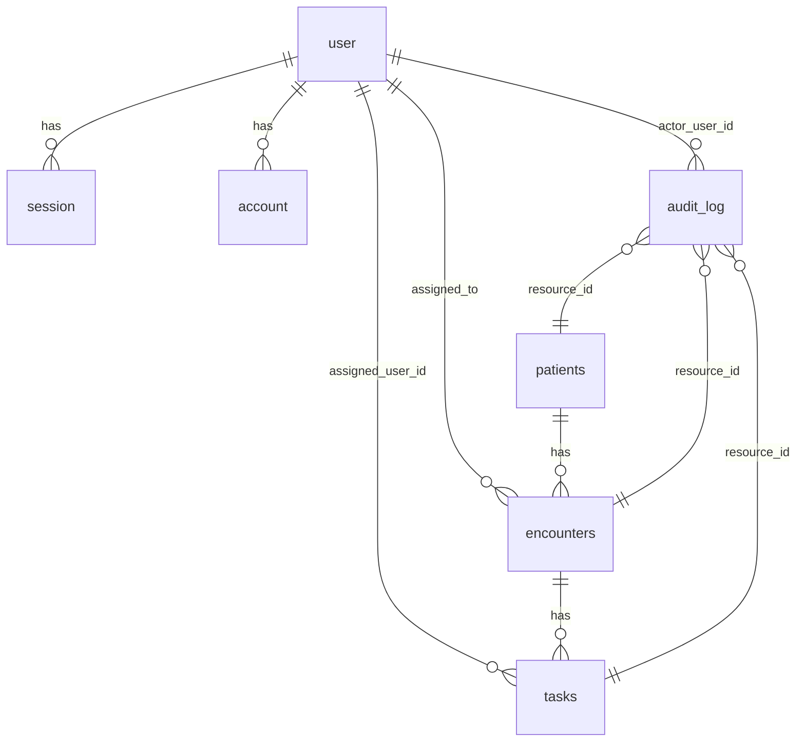

# Schema Blueprint — Patient Flow

> **Source of truth for database schema.** All Drizzle ORM definitions must conform to this blueprint.
>
> **How to use:** Attach `#schema.md` to Copilot chat when modifying `api/src/core/db/schema.ts` or generating migrations.
>
> **Drift check:** Run `/check-contract-drift` to compare this blueprint against `schema.ts`.

**Database:** PostgreSQL 18 · **ORM:** Drizzle
**Schema file:** `api/src/core/db/schema.ts` (single file — never split)
**Migration workflow:** schema change → `npm run db:generate` → review SQL → `npm run db:migrate`

---

## Conventions

| Convention | Rule |
|-----------|------|
| Business entity IDs | `uuid("id").primaryKey().default(sql\`uuidv7()\`)` — never `gen_random_uuid()` |
| Auth table IDs | `text("id").primaryKey()` — Better Auth convention |
| Table naming | `snake_case`, plural (e.g., `patients`, `encounters`) |
| Column naming | `snake_case` (e.g., `first_name`, `created_at`) |
| Timestamps | `timestamp('created_at').defaultNow().notNull()` + `timestamp('updated_at').defaultNow().notNull()` |
| Enums | `text` columns with inline comment listing valid values — never PG enum types |
| Flexible data | `jsonb` columns (e.g., `audit_log.diff`) |
| Foreign keys | `.references(() => table.id, { onDelete: 'cascade' | 'set null' })` |
| Indexes | Named `<table>_<column>_idx`, defined in table's second argument |

---

## Auth Tables (Better Auth Managed)

> These tables are managed by Better Auth. Do not modify their structure — only add columns to `user` for app-specific fields.

### `user`

| Column | Type | Constraints | Notes |
|--------|------|-------------|-------|
| `id` | `text` | PK | Better Auth text ID |
| `name` | `text` | nullable | Display name |
| `email` | `text` | NOT NULL, UNIQUE | |
| `emailVerified` | `boolean` | default `false` | |
| `image` | `text` | nullable | Avatar URL |
| `role` | `text` | NOT NULL, default `'front_desk'` | `admin` \| `provider` \| `clinical_staff` \| `front_desk` |
| `title` | `text` | nullable | Professional designation |
| `status` | `text` | NOT NULL, default `'active'` | `active` \| `suspended` |
| `createdAt` | `timestamp` | NOT NULL, default now | |
| `updatedAt` | `timestamp` | NOT NULL, default now | |

### `session`

| Column | Type | Constraints |
|--------|------|-------------|
| `id` | `text` | PK |
| `expiresAt` | `timestamp` | NOT NULL |
| `token` | `text` | NOT NULL, UNIQUE |
| `ipAddress` | `text` | nullable |
| `userAgent` | `text` | nullable |
| `userId` | `text` | NOT NULL, FK → `user.id` (cascade) |
| `createdAt` | `timestamp` | NOT NULL, default now |
| `updatedAt` | `timestamp` | NOT NULL, default now |

### `account`

| Column | Type | Constraints |
|--------|------|-------------|
| `id` | `text` | PK |
| `accountId` | `text` | NOT NULL |
| `providerId` | `text` | NOT NULL |
| `userId` | `text` | NOT NULL, FK → `user.id` (cascade) |
| `accessToken` | `text` | nullable |
| `refreshToken` | `text` | nullable |
| `idToken` | `text` | nullable |
| `accessTokenExpiresAt` | `timestamp` | nullable |
| `refreshTokenExpiresAt` | `timestamp` | nullable |
| `scope` | `text` | nullable |
| `password` | `text` | nullable |
| `createdAt` | `timestamp` | NOT NULL, default now |
| `updatedAt` | `timestamp` | NOT NULL, default now |

### `verification`

| Column | Type | Constraints |
|--------|------|-------------|
| `id` | `text` | PK |
| `identifier` | `text` | NOT NULL |
| `value` | `text` | NOT NULL |
| `expiresAt` | `timestamp` | NOT NULL |
| `createdAt` | `timestamp` | NOT NULL, default now |
| `updatedAt` | `timestamp` | NOT NULL, default now |

---

## Business Tables

### `patients`

| Column | Type | Constraints | Notes |
|--------|------|-------------|-------|
| `id` | `uuid` | PK, default `uuidv7()` | |
| `first_name` | `text` | NOT NULL | |
| `last_name` | `text` | NOT NULL | |
| `date_of_birth` | `timestamp` | nullable | |
| `phone` | `text` | nullable | |
| `email` | `text` | nullable | |
| `address` | `text` | nullable | |
| `notes` | `text` | nullable | |
| `created_at` | `timestamp` | NOT NULL, default now | |
| `updated_at` | `timestamp` | NOT NULL, default now | |

**Indexes:**
| Name | Columns |
|------|---------|
| `patients_name_idx` | `last_name`, `first_name` |
| `patients_email_idx` | `email` |

---

### `encounters`

| Column | Type | Constraints | Notes |
|--------|------|-------------|-------|
| `id` | `uuid` | PK, default `uuidv7()` | |
| `patient_id` | `uuid` | NOT NULL, FK → `patients.id` (cascade) | |
| `status` | `text` | NOT NULL | `scheduled` \| `checked_in` \| `in_progress` \| `completed` \| `cancelled` |
| `assigned_to` | `text` | nullable, FK → `user.id` (set null) | Ownership lock |
| `scheduled_time` | `timestamp` | nullable | |
| `notes` | `text` | nullable | |
| `version` | `integer` | NOT NULL, default `0` | Optimistic lock |
| `created_at` | `timestamp` | NOT NULL, default now | |
| `updated_at` | `timestamp` | NOT NULL, default now | |

**Indexes:**
| Name | Columns |
|------|---------|
| `encounters_patient_idx` | `patient_id` |
| `encounters_status_idx` | `status` |
| `encounters_assigned_to_idx` | `assigned_to` |
| `encounters_scheduled_time_idx` | `scheduled_time` |

**FSM Transition Map:**
```
scheduled   → [checked_in, cancelled]
checked_in  → [in_progress, cancelled]
in_progress → [completed, cancelled]
completed   → [] (terminal)
cancelled   → [] (terminal)
```

---

### `tasks`

| Column | Type | Constraints | Notes |
|--------|------|-------------|-------|
| `id` | `uuid` | PK, default `uuidv7()` | |
| `encounter_id` | `uuid` | NOT NULL, FK → `encounters.id` (cascade) | |
| `title` | `text` | NOT NULL | |
| `description` | `text` | nullable | |
| `status` | `text` | NOT NULL | `todo` \| `in_progress` \| `done` |
| `priority` | `text` | NOT NULL | `low` \| `medium` \| `high` |
| `assigned_user_id` | `text` | nullable, FK → `user.id` (set null) | |
| `assigned_role` | `text` | nullable | |
| `blocking` | `boolean` | NOT NULL, default `false` | |
| `due_at` | `timestamp` | nullable | |
| `created_at` | `timestamp` | NOT NULL, default now | |
| `updated_at` | `timestamp` | NOT NULL, default now | |

**Indexes:**
| Name | Columns |
|------|---------|
| `tasks_encounter_idx` | `encounter_id` |
| `tasks_status_idx` | `status` |
| `tasks_assigned_user_idx` | `assigned_user_id` |
| `tasks_priority_idx` | `priority` |

---

### `audit_log`

> **Append-only.** Never update or delete rows. No `updated_at` column.

| Column | Type | Constraints | Notes |
|--------|------|-------------|-------|
| `id` | `uuid` | PK, default `uuidv7()` | |
| `actor_user_id` | `text` | NOT NULL, FK → `user.id` (cascade) | |
| `actor_role` | `text` | NOT NULL | |
| `action` | `text` | NOT NULL | Format: `entity.verb` (e.g., `patient.created`) |
| `resource_type` | `text` | NOT NULL | e.g., `patient`, `encounter`, `task` |
| `resource_id` | `uuid` | NOT NULL | |
| `diff` | `jsonb` | nullable | `{ field: { from, to } }` |
| `ip_address` | `text` | nullable | |
| `created_at` | `timestamp` | NOT NULL, default now | |

**Indexes:**
| Name | Columns |
|------|---------|
| `audit_log_actor_idx` | `actor_user_id` |
| `audit_log_resource_idx` | `resource_type`, `resource_id` |
| `audit_log_action_idx` | `action` |
| `audit_log_created_at_idx` | `created_at` |

---

## Entity Relationships



---

## Adding a New Table — Checklist

When adding a new business table, ensure:

1. [ ] Table name is `snake_case`, plural
2. [ ] `id` column uses `uuid("id").primaryKey().default(sql\`uuidv7()\`)`
3. [ ] `created_at` and `updated_at` timestamps with `.defaultNow().notNull()`
4. [ ] Foreign keys use `.references()` with explicit `onDelete` policy
5. [ ] Indexes defined in table's second argument, named `<table>_<column>_idx`
6. [ ] Enum values stored as `text` with inline comment listing valid values
7. [ ] Schema blueprint (`docs/contracts/schema.md`) updated
8. [ ] API spec (`docs/contracts/api_spec.md`) updated if table has endpoints
9. [ ] `npm run db:generate` run and SQL reviewed
10. [ ] `npm run db:migrate` run to apply
